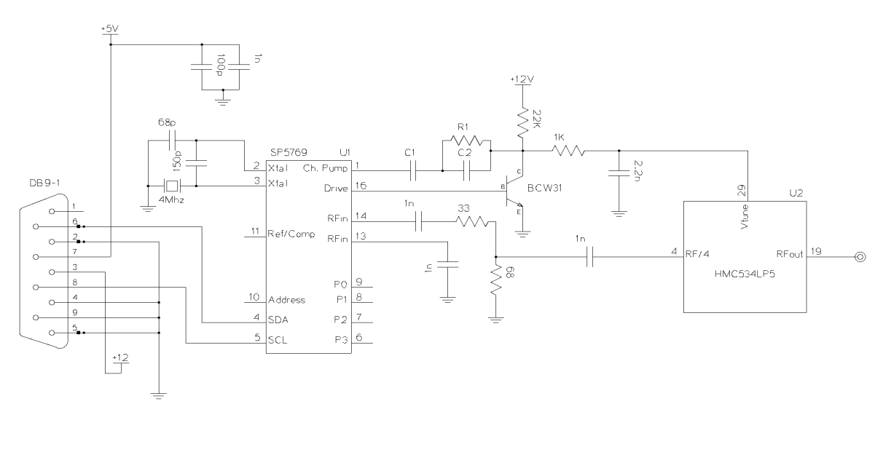

# Sintetizador de Frecuencias en banda Ku 

## Funcionamiento
    El dispositivo genera una señal en banda Ku {10,6 , 11,8} GHz. Con un paso de 1Mhz, teniendo 1200 Valores posibles. Estos se envían a través de una aplicacion de Android usando Bluetooth. También es posible realizar un barrido de frecuecnias, con un paso menor, 0,25 MHz.

Este repositorio contiene el código para controlar un Sintentizador de frecuencias Zarlink SP5769 que controla un VCO HMC534LP5.

La dirección I2C del SP5769 se selecciona con el nivel del tension aplicado a ADDRESS (%Vcc) ADDRESS = "11000101"

El ESP32 debe escribir en los registros del SP5769 los valores (a través de un bus I2C). Los registros son:
## Programmable divider: 
    Controla la razón entre la frecuencia del VCO interno y la de referencia (Un numero de 15 bit)
## Control Data: Tiene varios bits que controlan el funcionamiento (Ver datasheet para saber posicion):

    [R3:R0]: Controla el divisor de frecuencia de referencia (Ver tabla) - Ajustado al valor 64 -> 0101

    [C1:C0]: Seleccion la corriente de la bomba de carga. Ver tabla datasheet (Valor fijado por el circuito)

    RE: Enable del oscilador de ref 

    [T2:T0] = Bits de control de modo test - No se usa

    [P3:P0] = Estados del puerto de salida - No se usa

    RS: REF/COMP seleccion (Se usa alta impedancia)

Aquí se configura: Modo Test Off, Corriente de la bomba de carga Icp=+-155[µA], pin
de REF/COMP en alta impedancia, y todos los puertos, P3 a P0 a 0[V]

## Especifaciones del programa 
### Iniciar 
    El programa debe iniciar la comunicación por bluetooth y configurar el registro de control según se indica en el documento "INFORME-TRABAJO-GRADUACION-CANGEMI-JOSE-I.pdf". Luego debe esperar por cualquiera de las 2 instrucciones posibles.

### Ajuste de frecuencia
    El programa debe recibir por bluetooth el valor de la frecuncia deseada, luego debe calcular el valor del multiplicador necesario y escribirlo en los registros programmable divider.

### Barrido de frecuencia
    El programa de barrer las frecuencias sintetizables en un tiempo indicado por el usuario. Con limites Tmin y Tmax

El valor recibido es una cadena de caracteres con la frecuencia 

